# Computação Gráfica

O presente repositório consiste em um projeto de reavalização da disciplina computação gráfica feito através do uso da ferramenta OpenGL e da linguagem de programação Python 3.9.

# Projeto

O projeto consiste em modelar um avião usando Textura e Iluminação e simular um sobrevoo pela cidade de Maceió.

* É possível controlar o avião usando o teclado de modo a simular o sobrevoo sobre uma parte da cidade;
* A cidade foi simulada através do mapeamento de textura de uma imagem aérea noturna no formato jpg;
* A iluminação foi usada na cabine do avião e em uma lua modelada tendo como base projetos anteriores da disciplina.

  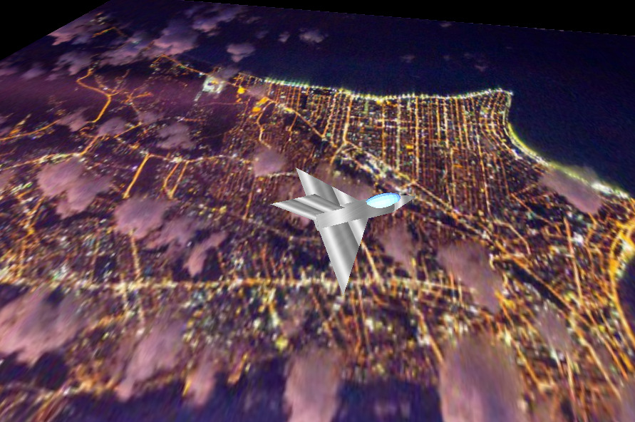

# Controles

Como falado anteriormente o projeto possui alguns controles básicos, os quais não apenas permitem o sobrevôo do avião, bem como diferentes formas de visualizar e controlar o mesmo. Além disso, existem controle para desativar e ativar a iluminação.

* <kbd>w</kbd> : Mover o avião para frente de modo manual;
* <kbd>p</kbd>: Ativar e desativar "piloto automático" e fazer o avião se mover para frente sem a necessidade de segurar ou apertar a tecla w;
* <kbd>a</kbd>: Rotacionar o avião horizontalmente para a esquerda;
* <kbd>d</kbd>: Rotacionar o avião horizontalmente para a direita;
* <kbd>l</kbd>: Ativar e reativar a iluminação;
* <kbd>+</kbd> Diminui a distância entre o observador e o centro de rotação (zoom-in);
* <kbd>-</kbd> Aumenta a distância entre o observador e o centro de rotação (zoom-out);
* <kbd>&#8593;</kbd> Aumenta a posição do observador no eixo y;
* <kbd>&#8595;</kbd> Diminui a posição do observador no eixo y;
* <kbd>&#8594;</kbd> Rotacionar a posição do observador em torno do eixo y no sentido horário;
* <kbd>&#8592;</kbd> Rotacionar a posição do observador em torno do eixo y no sentido antihorário.

# Imagens de Execução

As imagens de execução referentes à visão do observador sobre o avião são de dois tipos: as normais e inclinadas, pois devido a natureza de modelagem 2D das asas e calda, as mesmas ficam pouco visíveis sem haver uma leve inclinação.

## Iluminação

| Iluminação Ligada                                                                          | Iluminação Desligada                                                                                |
|--------------------------------------------------------------------------------------------|-----------------------------------------------------------------------------------------------------|
| 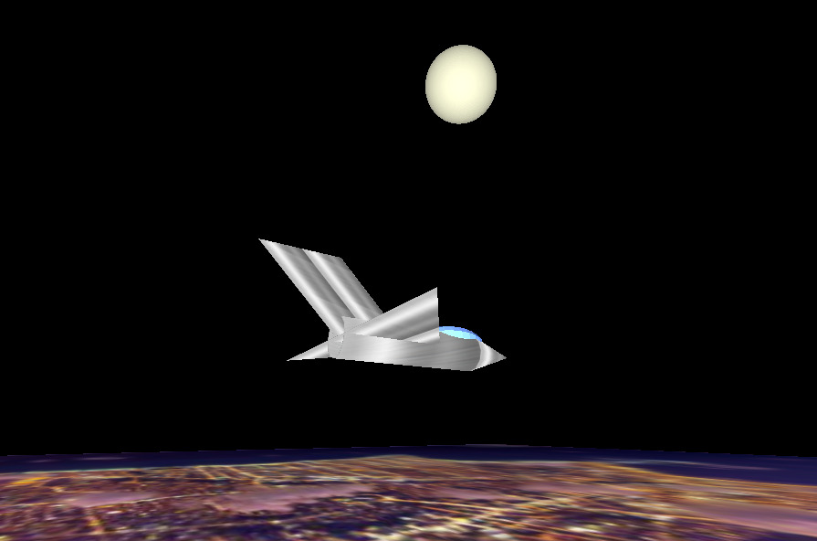   | 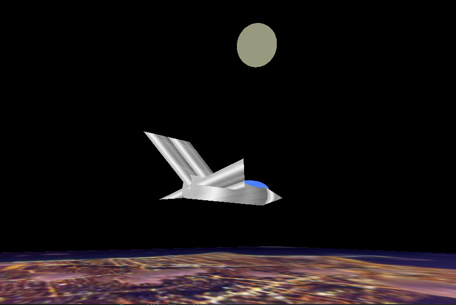 |
| 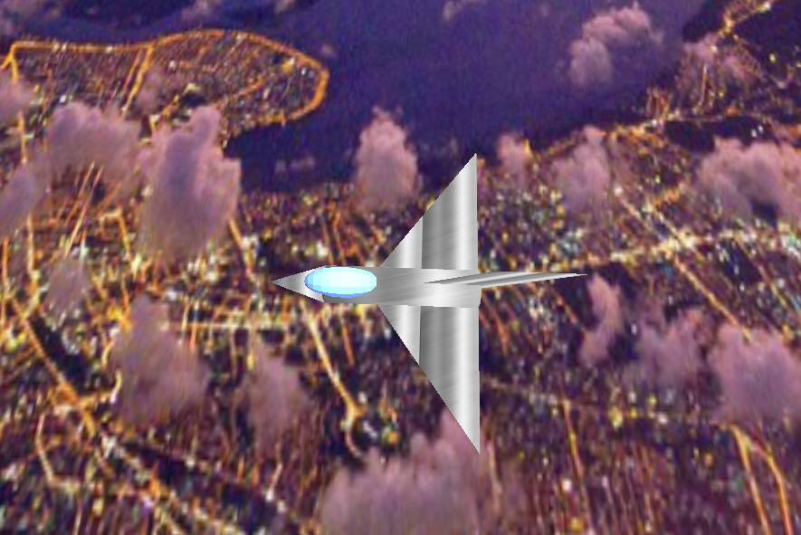 | 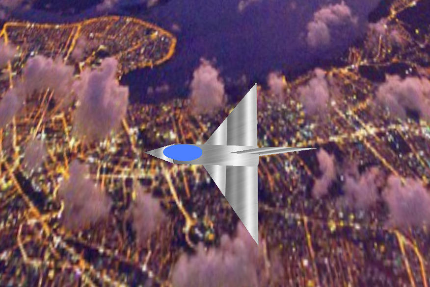          |

## Visão Frontal do Avião
| Visão Frontal                                                                            | Visão Frontal Inclinada                                                                             |
|------------------------------------------------------------------------------------------|-----------------------------------------------------------------------------------------------------|
| 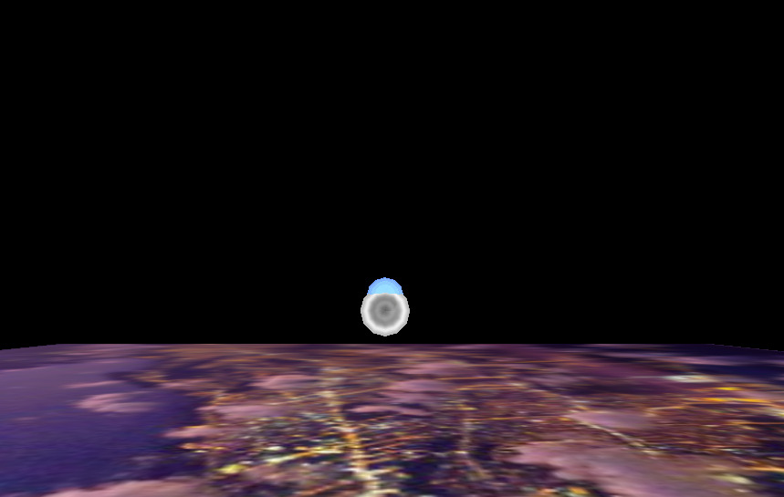 | 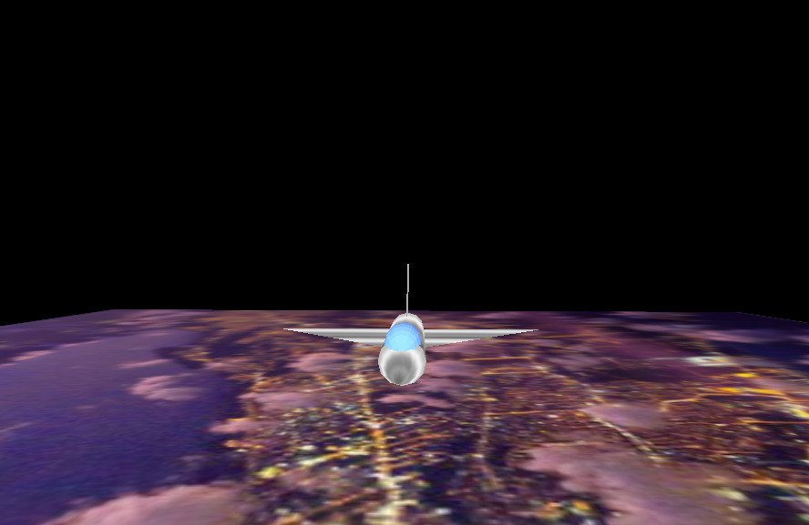 |

## Visão Posterior do Avião

| Visão Posterior                                                                                      | Visão Posterior Inclinada                                                                                                |
|--------------------------------------------------------------------------------------------|------------------------------------------------------------------------------------------------------|
| 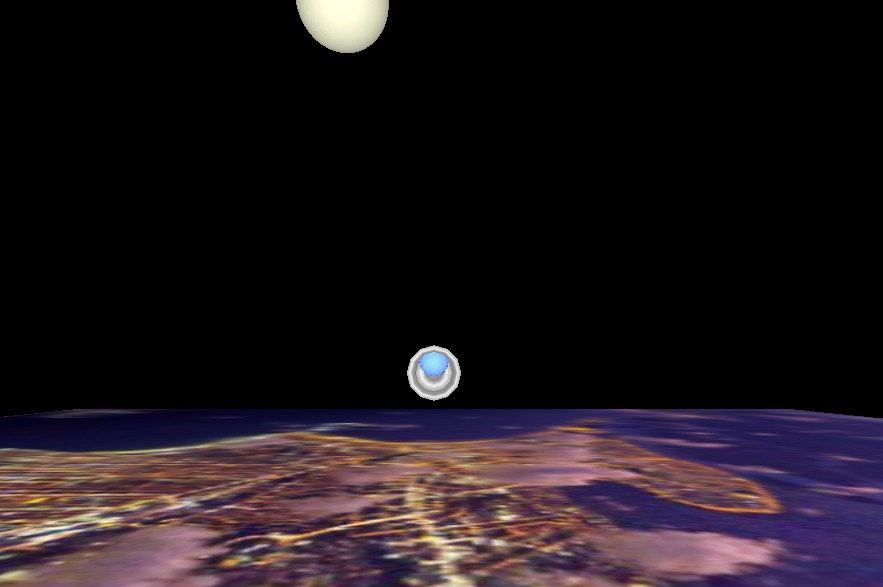 | 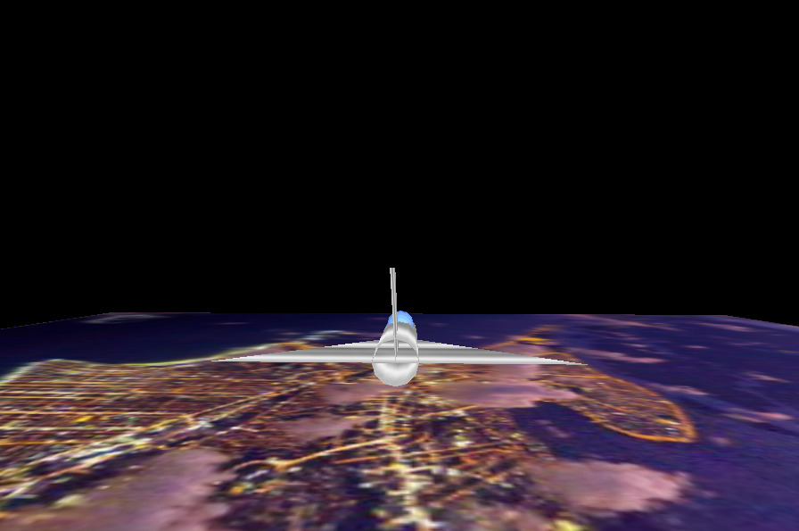 |

## Visão Lateral do Avião
| Visão Lateral                                                                            | Visão Lateral Inclinada                                                                             |
|------------------------------------------------------------------------------------------|-----------------------------------------------------------------------------------------------------|
| 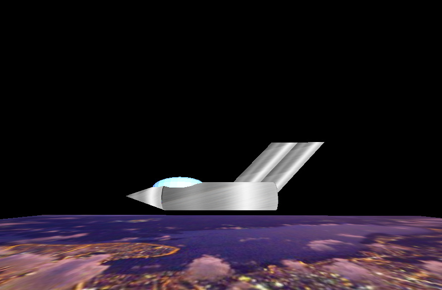 | 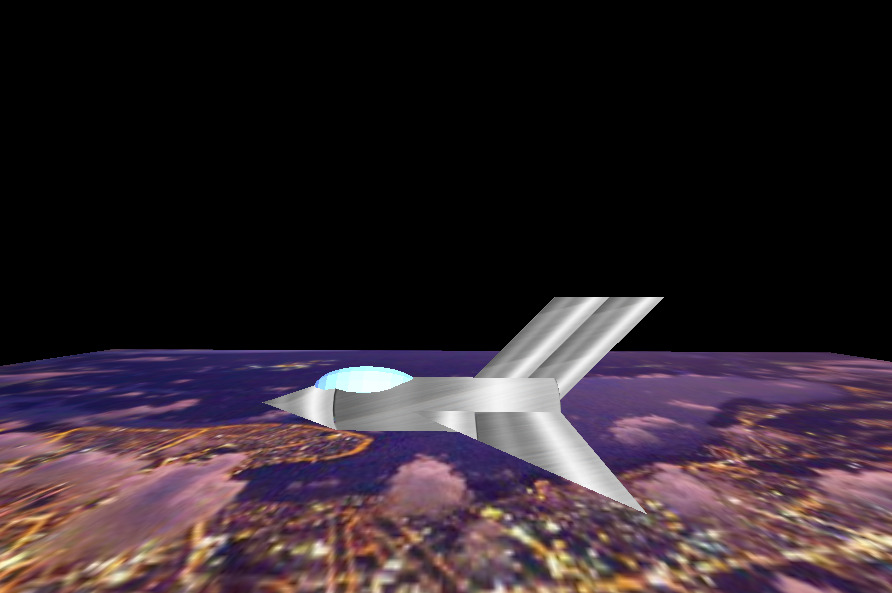 |

